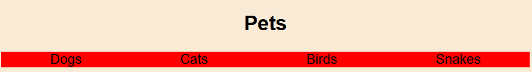

# Lesson 2 - Flexbox Fundamentals

## Overview

This lesson introduces CSS Flexbox, a powerful layout method that makes it easy to create responsive designs. Students will learn how Flexbox relates to Figma's Auto Layout and how to translate responsive design concepts from design tools to code.

## What We Will Do

### Part 1: Flex Manual
Firstly, we will look at the flexbox manual that will go through all of the major options for Flexbox.

### Part 2: Practical Exercise
After that, we will create a small HTML file that implements a flexbox layout that looks like the image below:

